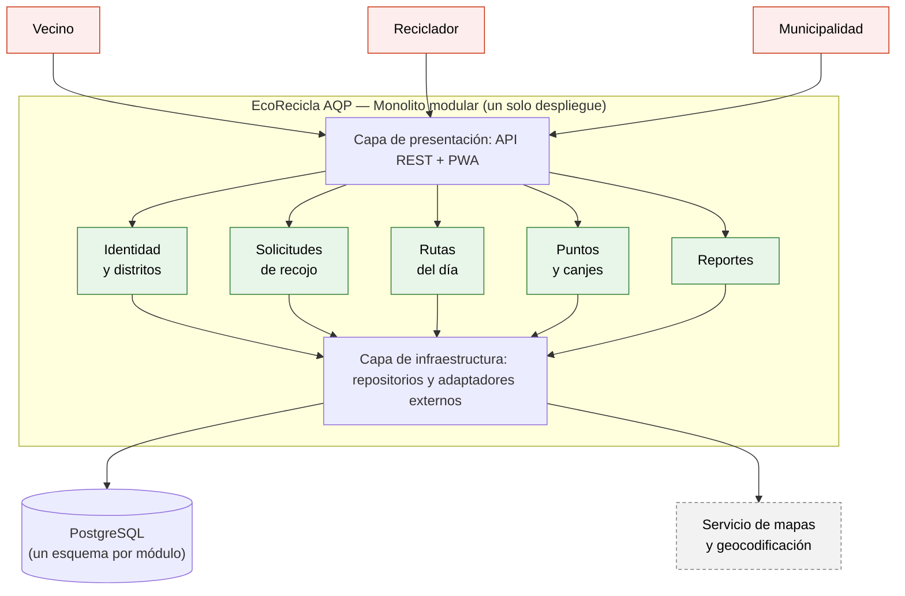
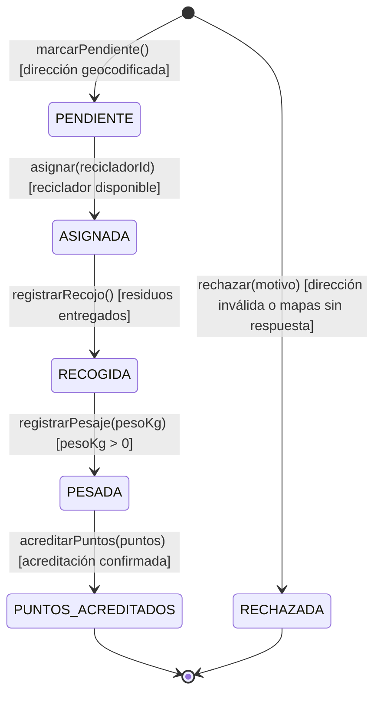

# EcoRecicla AQP — Laboratorio 04: Fundamentos de arquitectura de software
Construcción de Software · EPIS-UNSA · 2026-B · Grupo 10

## Integrantes
| Nombre | Rol en el laboratorio |
|--------|-----------------------|
| Condori Caira Antony Beltran | Redactor de drivers y de ADR-001; responsable del README |
| Sencia Ale Bryan Daniel | Matriz de decisión y diagramador (Mermaid y PlantUML) |
| Yauli Merma Diego Raul | Redactor de ADR-002 y ADR-003; vista de despliegue y verificador de IA |

## Caso
EcoRecicla AQP es una plataforma para el recojo de residuos reciclables con recicladores formalizados en distritos de Arequipa. Los vecinos solicitan recojos y canjean puntos, los recicladores consultan su ruta del día y registran el peso recogido, y la municipalidad consulta reportes de toneladas recicladas. El MVP debe estar en producción en 1 mes con 3 desarrolladores (Node.js y PostgreSQL) y presupuesto bajo. El atributo de calidad crítico es la **modificabilidad**: incorporar un nuevo distrito o una nueva regla de puntos en ≤ 2 días-persona, sin modificar los demás módulos.

## Arquitectura elegida

## Decisiones arquitectónicas
- [ADR-001: Estilo arquitectónico](docs/architecture/adr/001-estilo-arquitectonico.md)
- [ADR-002: Base de datos](docs/architecture/adr/002-base-de-datos.md)
- [ADR-003: PWA para el reciclador](docs/architecture/adr/003-pwa-reciclador.md)

## Reflexión sobre el uso de la IA (5–8 líneas)
Claude nos ayudó a estructurar los entregables, a redactar los borradores de drivers, matriz de decisión, ADR y README, y a repartir el trabajo entre los tres. Sus borradores incluyeron supuestos que no le habíamos dado (conectividad intermitente de los recicladores, aplicación de la Ley 29733 y uso de un servicio de mapas), que documentamos como supuestos S-01 a S-03 en `drivers.md`. Recalculamos los totales de la matriz con un script y comprobamos que la segunda mejor alternativa es el monolito en capas, no microservicios como en el ejemplo de la guía, por lo que la alternativa descartada que diagramamos es capas. La crítica adversarial señaló riesgos reales del monolito modular (erosión de límites, punto único de falla, duplicados por la sincronización sin conexión) y los incorporamos como mitigaciones en los ADR. Aprendimos que la IA propone, pero cada supuesto y cada cálculo debe contrastarse con nuestras restricciones: plazo de 1 mes, 3 desarrolladores y presupuesto bajo. El detalle está en la [bitácora de uso de IA](docs/architecture/bitacora-ia.md).

## Vista de despliegue (E6)

[Diagrama y reproducción](docs/architecture/diagramas/README.md). Se incluye una vista alternativa PlantUML porque no se pudo instalar Graphviz; el PNG adjunto se renderizó localmente con Pillow. El script también admite Python Diagrams, pendiente de ejecución con sus dependencias instaladas.

## Diseño UML (Lab 05)

Diseño detallado del módulo **Solicitudes de recojo** de EcoRecicla AQP (HU-01: *Solicitar el recojo de residuos reciclables*), coherente con el ADR-001 (monolito modular, puertos y adaptadores). Diagramas escritos como código (PlantUML y Mermaid).

### Máquina de estados de `Solicitud` (Mermaid)

### Entregables

| Código | Entregable | Archivo | Imagen |
|---|---|---|---|
| E1 | Historia de usuario y diagrama de clases | [historia.md](docs/design/historia.md), [clases.puml](docs/design/clases.puml) | [E1_clases-solicitudes.png](docs/design/img/E1_clases-solicitudes.png) |
| E2 | Diagrama de secuencia | [secuencia-solicitar-recojo.puml](docs/design/secuencia-solicitar-recojo.puml) | [E2_secuencia-solicitar-recojo.png](docs/design/img/E2_secuencia-solicitar-recojo.png) |
| E3 | Máquina de estados | [estados-solicitud.mmd](docs/design/estados-solicitud.mmd) | [E3_estados-solicitud.png](docs/design/img/E3_estados-solicitud.png) |
| E4 | Diagrama de actividades | [actividades-ruta-diaria.puml](docs/design/actividades-ruta-diaria.puml) | [E4_actividades-ruta-diaria.png](docs/design/img/E4_actividades-ruta-diaria.png) |
| E5 | Diagrama de paquetes | [paquetes.puml](docs/design/paquetes.puml) | [E5_paquetes.png](docs/design/img/E5_paquetes.png) |
| E6 | Round-trip (código, ingeniería inversa, diferencias) | [src/solicitudes/](src/solicitudes/), [round-trip.md](docs/design/round-trip.md) | [classes_solicitudes.png](docs/design/img/classes_solicitudes.png) |
| E7 | Consistencia C1-C5 y bitácora de IA | [consistencia.md](docs/design/consistencia.md), [bitacora-ia.md](docs/design/bitacora-ia.md) | - |

### Reglas de consistencia verificadas

C1 (mensajes y operaciones), C2 (transiciones y operaciones), C3 (multiplicidades), C4 (paquetes sin ciclos, coherentes con el ADR-001) y C5 (nombres del dominio). Los hallazgos y falsos positivos de la revisión con IA están en [consistencia.md](docs/design/consistencia.md).

Etiqueta de entrega: `v0.5-diseno`.