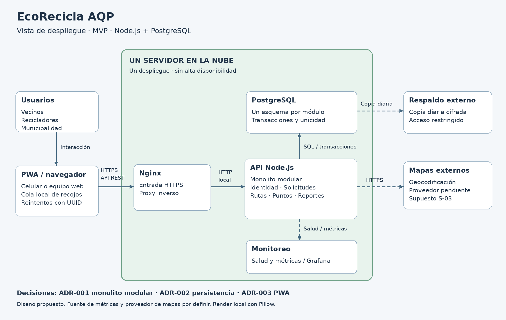

# Vista de despliegue — E6 (Diego)



La imagen representa un diseño, no infraestructura ya desplegada. Mantiene los cinco módulos de ADR-001, PostgreSQL de ADR-002 y la PWA de ADR-003.

## Reproducción con Python Diagrams

Instalar Graphviz (comando `dot`) y las dependencias de Python:

```bash
python3 -m venv /tmp/ecorecicla-diagramas
/tmp/ecorecicla-diagramas/bin/pip install diagrams Pillow
/tmp/ecorecicla-diagramas/bin/python docs/architecture/diagramas/despliegue.py
```

El PNG se guarda siempre en `docs/architecture/diagramas/img/despliegue.png`.

## Generación realizada y alternativa

Este entorno carece de Diagrams y Graphviz y no tiene red en la terminal. El PNG incluido se generó y revisó con el renderizador local de Pillow incluido en el mismo script:

```bash
python3 docs/architecture/diagramas/despliegue.py --sin-graphviz
```

No es una imagen renderizada por Python Diagrams. Se incluye `despliegue.puml` como vista de despliegue alternativa, conforme a la alternativa de E6 cuando no puede instalarse Graphviz. El PNG local representa esa misma topología. La ejecución con Diagrams y el renderizado con PlantUML no se pudieron verificar aquí. Si se exige la salida exacta de alguno de esos motores, regenerar el PNG con el comando correspondiente antes de la entrega final.

Al integrar, enlazar esta nota desde el README del grupo; el procedimiento `preparar-rama.sh` agrega la nota sin reemplazar su contenido.
